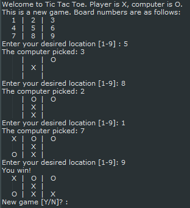

# Tic-tac-toe game

## RECOMMENDED PRIOR UNDERSTANDING

## RECOMMENDED PACKAGES

## RECOMMENDED RESOURCES

## TASK

Mastering the art and skill of programming requires good problem solving skills. This exercise requires you to read input in from a user, perform some logic on it, and spit out some new information back to the user. You need to understand how to keep repeating a loop until a goal is met. You also need to understand how to make the program make decisions, as this will be a game of player verses computer. Once you complete this you'll feel accomplished and ready to take on a more complicated project.

Here are the project goals:

1. Assume the user (player) is an X and the computer is a O
2. Ask the player where they want to place their X
3. The computer places an O
4. Output the 9 tiles showing where each player went
5. Ask the player where they want to place their X
6. Repeat until a winner is determined

Sound pretty simple? Go and make it! Then play it. Try and break it. Put an X where an O is. 

What happens when there is a "Cat" game (no winner)? Here's what I am suggesting for the final product:

## REMEMBER

* Your program must include appropriate prompts for the entry of data.
* Error messages and other output need to be set out clearly.
* All variables, constants and other identifiers must have meaningful names.

